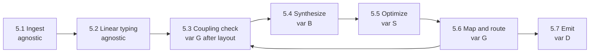

# Core Domain Distillation — Quantum Compilation

**Status:** Draft · **Domain:** `quantum` · **Code:** `quantum/` · **Branch:** `master`
**Companion:** `docs/quantum/domain-vision.md`

## 1. Purpose of this document

The vision statement says *what* the quantum domain is for. This document
says *how the domain is meant to work*: the vocabulary, the behaviors, the
rules those behaviors enforce, and the way the pieces relate. It is the
reference a contributor should read before changing the pipeline, and the
reference a reviewer should read before judging whether a change belongs.

This domain is not implemented yet. `tiferet-quantum` is a fresh repository
on `master` with no `quantum/` package, no configuration, and no tests.
Every behavior below is an intended pipeline grounded in the Hopf et al.
(2026) MLIR integration study, the MLIR dialect and pass model, and
Tiferet's Abstract Core conventions. Module paths in Section 5 are
*intended* placements for later Requests for Prototype (RFPs). An RFP is
a public issue that states one domain theory and the acceptance criteria
for testing it on a prototype branch. It is not a Technical Requirements
Document (TRD). A TRD is the later trunk specification used to
reconstruct a frozen catalog, or to hotfix a mechanical defect, on the
main line. The paths below are not citations of files that already exist.

Read this document when:

* proposing an RFP that adds quantum vocabulary, invariants, or a
  compilation step
* integrating a backend (MQT QMAP, Catalyst, PyZX, Qiskit, Cirq)
* auditing linear-typing rules, coupling checks, or emission boundaries

## 2. The core domain, restated precisely

The quantum domain's core work is **representing a quantum program as
checked domain state and lowering that state through a declared
compilation pipeline**.

A quantum program is not a string. It is a sequence of operations on named
qubits, constrained by physical law and by a target device. The domain
treats those constraints as grammar: it builds one circuit model, verifies
the model, transforms it, and only then emits a backend-specific form.

The domain has one shape:

> **Ingest** → **Verify** → **Synthesize** → **Optimize** → **Map** → **Emit**

and exactly four axes of variation:

1. **Gate basis set (B)** — the operation vocabulary the circuit must
   finally use (Clifford+T `{H, S, T, CNOT}`, universal rotations
   `{Rx, Ry, Rz, CNOT}`, or a device-native set).
2. **Hardware coupling topology (G)** — the connectivity graph of the
   physical device (linear chain, heavy-hex, all-to-all trapped ion,
   neutral-atom shuttling array).
3. **Optimization strategy (S)** — the objective of a rewrite (T-depth,
   two-qubit gate count, circuit depth, SWAP overhead).
4. **Target emission dialect (D)** — the form handed to a backend (MLIR
   `quantum`, MLIR `mqtopt`, OpenQASM 3.0, QIR, or a native simulator
   object).

Everything else — qubit identity, linear consumption, register
membership, pass orchestration, and the service seam to third-party
solvers — is the same job on every point of those axes. Naming the axes
is what makes later RFPs scopeable. Section 8 treats the seam directly.

## 3. Ubiquitous language

**Qubit** — the fundamental quantum informational unit: an immutable
domain object with a unique identifier and, when it belongs to a register,
an index.

**Quantum register** — an ordered collection of qubits treated as one
logical or physical addressing unit.

**Quantum gate** — a unitary operation on one or more target qubits, with
optional classical parameters (rotation angles) and optional control-qubit
modifiers.

**No-cloning theorem** — the physical law that an unknown quantum state
cannot be copied. In this domain it is enforced as linear typing.

**Linear typing (single-use token)** — the invariant that each qubit value
is produced once and consumed once by the next operation. A second read of
the same qubit token is a domain error, not a later compiler crash.

**Coupling map** — the hardware connectivity graph G = (V, E) that names
which physical qubit pairs may legally share a two-qubit gate.

**Qubit layout (placement)** — the initial mapping from virtual program
qubits to physical device qubits.

**SWAP** — an operation that exchanges the states of two adjacent physical
qubits so that a later two-qubit gate becomes legal on G.

**Routing** — the insertion of SWAP (or shuttling) operations along G
until every two-qubit gate acts on adjacent physical qubits.

**Synthesis** — expansion of a high-level unitary or functional block into
a sequence of gates from a chosen basis B.

**Circuit aggregate** — the root mutable entity that holds registers, the
ordered instruction sequence, the current layout, and the invariant
ledger. Domain objects inside it remain read-only; mutation goes through
this aggregate.

**Dialect** — an isolated operation vocabulary and namespace. In MLIR this
is a dialect (`quantum`, `mqtopt`, `quake`, `scf`). In this codebase it is
the `quantum` bounded context and, later, any emission vocabulary we
choose to speak.

**Pass** — one bounded transformation or analysis applied to a circuit
aggregate. In Tiferet a pass is a domain event, not an LLVM C++ pass
class.

**OpenQASM** — a textual quantum assembly language used as a common
exchange format. It is an emission (and optional ingest) target, not the
domain model.

**QIR** — the Quantum Intermediate Representation, an LLVM IR convention
for quantum programs. It is an emission target, not the domain model.

**Feature workflow** — a declared sequence of domain events that the
application runs as one capability (for example `quantum.compile`).

## 4. What the domain reads / operates on

The domain operates on three kinds of input:

1. **Declarative circuit definitions** — a Python builder, a structured
   YAML declaration, or an imported OpenQASM program that names registers,
   gates, parameters, and (later) structured control flow.
2. **Device topology profiles** — a coupling map, a native gate set, and
   any calibration limits the mapper is allowed to see.
3. **Pass configuration** — which basis B, which strategy S, which
   topology G, and which emission dialect D this run should use.

Two conventions give the domain its leverage:

**The circuit model is the source of truth.** OpenQASM, MLIR text, and QIR
are projections. If a fact cannot be stated on the circuit aggregate, it
is not yet in the domain.

**Physical law is checked before search.** Linear typing and coupling
legality are domain rules. Placement search, SAT layout, and ZX rewriting
are delegated services. The domain refuses illegal state; the service
proposes a better legal state.

## 5. The behaviors

Each behavior is a bounded step with a defined input and output. None of
the paths below exist yet. They name the *intended* Tiferet placement so
an RFP can own a file rather than a slogan.

### 5.1 Ingest circuit

*Capture an input program as a circuit aggregate with virtual registers.*

* **Intended location:** `quantum/events/ingest.py` (`IngestCircuit`),
  reading a builder or an OpenQASM string through a service in
  `quantum/interfaces/`.
* **Produces:** a circuit aggregate with named virtual qubits and an
  instruction list, no physical layout required.
* **Verdict:** **Agnostic** on B, G, S, and D. Ingest normalizes; it does
  not choose a basis, a chip, a rewrite goal, or an emitter.

### 5.2 Validate linear typing

*Verify that every qubit reference satisfies single-use semantics.*

* **Intended location:** `quantum/events/validation.py`
  (`ValidateLinearTyping`), with the rule implemented on the circuit
  aggregate and a named error in `quantum/assets/`.
* **Produces:** the same aggregate, unchanged, or a domain error
  (`QUANTUM_LINEAR_TYPING_VIOLATION`).
* **Verdict:** **Agnostic** on all four axes. No-cloning does not depend
  on the chip or the emitter.

### 5.3 Validate coupling

*Verify that every two-qubit gate is legal on the current layout and
coupling map, or that the circuit is still virtual and therefore not yet
subject to G.*

* **Intended location:** `quantum/events/validation.py`
  (`ValidateCoupling`).
* **Produces:** the same aggregate, or `QUANTUM_COUPLING_VIOLATION`.
* **Verdict:** **Variable** on G once a physical layout exists; **agnostic**
  before placement. This is a check, not a search. Search is Section 5.6.

### 5.4 Synthesize basis gates

*Decompose high-level unitaries into the requested basis B.*

* **Intended location:** `quantum/events/synthesis.py` (`SynthesizeBasis`),
  delegating rewrite tables or a synthesis service.
* **Produces:** a circuit whose remaining gates are in B.
* **Verdict:** **Variable** on B; agnostic on G.

### 5.5 Optimize circuit

*Rewrite the circuit to reduce a declared cost (T-depth, two-qubit count,
depth, or SWAP estimate) without changing its meaning.*

* **Intended location:** `quantum/events/optimization.py`
  (`OptimizeCircuit`), with optional adapters (commutation and peephole
  first; PyZX later) behind `quantum/interfaces/`.
* **Produces:** an equivalent circuit aggregate with a lower cost under S.
* **Verdict:** **Variable** on S. A ZX adapter is a later edge, not part of
  the first local optimizer.

### 5.6 Map and route topology

*Choose a layout on G and insert SWAP (or shuttling) operations until every
two-qubit gate is adjacent.*

* **Intended location:** `quantum/events/mapping.py` (`MapTopology`),
  calling `QuantumMappingService`. The first adapter wraps MQT QMAP
  (`mqt.qmap`) in the infrastructure layer chosen by that RFP.
* **Produces:** a physically addressed circuit aggregate plus the layout
  that was used.
* **Verdict:** **Variable** on G. The service interface is agnostic; the
  QMAP adapter is not.

### 5.7 Emit target dialect

*Project the circuit aggregate into D without making D the source of
truth.*

* **Intended location:** `quantum/events/emission.py` (`EmitTargetDialect`)
  and transfer objects in `quantum/mappers/`. OpenQASM, MLIR `quantum`,
  MLIR `mqtopt`, and QIR are separate transfer roles, not one formatter
  with a switch statement pretending to be four dialects.
* **Produces:** a string or backend object in D.
* **Verdict:** **Variable** on D.

## 6. How the behaviors compose

After mapping, coupling validation runs again: a mapped circuit that still
violates G is a mapper defect, not a legal emission.

The intended application capability is a feature workflow
`quantum.compile` declared in the consumer's feature configuration. That
file does not exist yet. Do not invent `app/configs/feature.yml` as if it
were already the source of truth.

## 7. Relationships / cross-boundary rules

* **The circuit aggregate does not know how to print.** `Qubit`,
  `QuantumGate`, and the circuit aggregate have no OpenQASM or MLIR
  string logic. Printing lives on transfer objects in `quantum/mappers/`.
* **Search is a service, not a domain event body.** Placement, SAT layout,
  decision-diagram simulation, and ZX simplification execute behind
  service interfaces. The event checks preconditions, calls the service,
  and writes the result back through the aggregate.
* **Verification does not mutate.** Linear typing and coupling checks are
  pure with respect to the circuit: they accept or raise. Repair is a
  different event.
* **A dialect conversion is a pass, not an ingest.** Hopf et al. translate
  Catalyst `quantum` to `mqtopt` and back inside MLIR. If this domain ever
  speaks both dialects, that is an emit/ingest pair or a dedicated
  conversion event — it is not a reason to make OpenQASM the model again.

## 8. The agnostic core and the variable edge

**Agnostic — build once:**

* Qubit identity, registers, gates, and the circuit aggregate lifecycle
* Linear-typing verification
* Coupling *checking* (as opposed to coupling *search*)
* Pass orchestration through a feature workflow
* The service interfaces for synthesis, optimization, mapping, and
  emission

**Variable — one definition per case:**

* The gate tables for each basis B
* The coupling graph and native gate set for each device G
* The cost function and rewrite engine for each strategy S
* The transfer-object role for each dialect D
* Third-party adapters: MQT QMAP, Catalyst, PyZX, Qiskit, Cirq

**Entanglement inventory:**

* There is no code. The entanglement risk is in the *plan*, not in a
  line number. Section 10 keeps each theory on its own RFP so an
  acceptance surface can fail independently: value objects without
  invariants, the circuit aggregate without emitters, mapping without
  MLIR emission, and the feature workflow without the GHZ case study.

## 9. Boundaries

**Inside `quantum/`:** quantum vocabulary, circuit state, invariant
checks, synthesis/optimize/map orchestration, and projections to
OpenQASM / MLIR / QIR.

**Outside `quantum/`, owned by Tiferet:** dependency injection, the
application session, logging, CLI dispatch, and the base types
(`DomainObject`, `DomainEvent`, `Aggregate`, `TransferObject`, `Service`).

**Outside `quantum/`, owned by other libraries:** numerical simulation
(`mqt.ddsim`, PennyLane Lightning, Qiskit Aer), placement search
(`mqt.qmap`), diagrammatic rewrite (`pyzx`), and MLIR/LLVM code generation
(Catalyst, `mlir-opt`, QIR toolchains).

**Outside this paper's first proof:** pulse-level control, quantum error
correction as a domain of its own, and HPC job scheduling.

## 10. Where this leads

The first proof is 13 RFPs. Each item below is one theory and one
acceptance surface. Later trunk work, if any, is a TRD against a frozen
catalog, not these prototype slices.

1. **RFP — Application skeleton.** Consumer package layout, virtualenv,
   Tiferet wiring, empty `quantum/` component tree, and a test harness.
   Without this, every later RFP invents a different tree.
2. **RFP — Quantum value objects.** `Qubit`, `QuantumRegister`,
   `QuantumGate`, and `CouplingMap` as read-only domain objects. No
   pipeline, no backend.
3. **RFP — Circuit aggregate.** Instruction sequence, register ownership,
   and layout slots on `QuantumCircuitAggregate`. Mutation stays on the
   aggregate.
4. **RFP — Linear typing.** Single-use qubit tokens and
   `QUANTUM_LINEAR_TYPING_VIOLATION`. This is the no-cloning proof at the
   domain boundary; it is not an attribute on the value objects RFP.
5. **RFP — Circuit ingest.** A Python builder sufficient for the GHZ
   program in Hopf et al., plus optional OpenQASM 2 import of that same
   circuit. Ingest only.
6. **RFP — Coupling validation.** Reject an illegal two-qubit gate on a
   laid-out circuit. Still not a mapper.
7. **RFP — Basis synthesis.** One declared basis first (Clifford+T).
   Other bases are configuration, not a second synthesis engine.
8. **RFP — Local optimization.** Commutation and peephole under one
   declared strategy S. PyZX is a later adapter, not this RFP.
9. **RFP — Mapping service and MQT QMAP.** `QuantumMappingService` plus
   one adapter that places and routes on a supplied coupling map. This is
   Axis G's first variable edge.
10. **RFP — OpenQASM emission.** A transfer object that prints the
    circuit without becoming the model. Proves the mapper/domain split.
11. **RFP — MLIR dialect emission.** Separate roles for Catalyst
    `quantum` and MQT `mqtopt` text, matching the two dialects in Hopf et
    al. Figure 5. Not QIR, not a Catalyst JIT plugin.
12. **RFP — Compile feature workflow.** The declared
    ingest → verify → synthesize → optimize → map → emit pipeline, with
    errors and service registration. This is orchestration, not new
    physics.
13. **RFP — GHZ case study.** Reproduce the PennyLane/QMAP example from
    Hopf et al. (unmapped GHZ on a T-shaped five-qubit coupling map)
    entirely through the domain, and compare against the OpenQASM
    round-trip they rejected.

Follow-on, not in the first proof: PyZX as an optimization adapter, QIR
emission, a Catalyst plugin load, and structured control flow (`scf`
loops) so repeated blocks do not have to be unrolled before mapping.

Each of those 13 RFPs is independently falsifiable.
